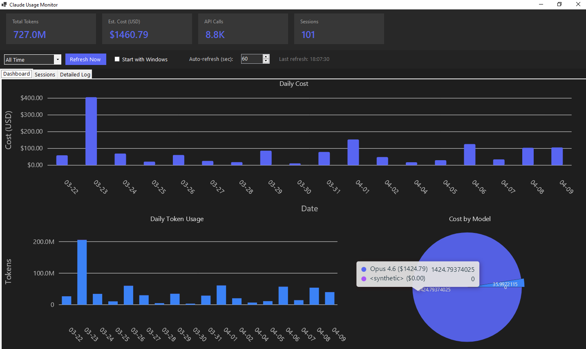

# Claude Usage Monitor

A Windows desktop dashboard that tracks your [Claude Code](https://docs.anthropic.com/en/docs/claude-code) API token usage and estimated costs in real time.




## Download (No Setup Required)

**Don't want to build from source?** Download the pre-built executable — no .NET installation needed:

[**Download ClaudeUsageMonitor v1.0.0 (Windows x64)**](https://github.com/vaibhavPH/ClaudeUsageMonitor/releases/download/v1.0.0/ClaudeUsageMonitor-v1.0.0-win-x64.zip)

1. Download and extract the zip
2. Double-click `ClaudeUsageMonitor.exe`
3. Done — the dashboard will show your Claude Code usage

> **Requirements:** Windows 10+ (x64) and [Claude Code](https://docs.anthropic.com/en/docs/claude-code) installed.

See all releases: [GitHub Releases](https://github.com/vaibhavPH/ClaudeUsageMonitor/releases)

---

## What It Does

Claude Code stores session data as JSONL files in `~/.claude/projects/`. This app parses those files and gives you a live dashboard showing:

- **Total tokens used** (input, output, cache read, cache creation)
- **Estimated cost in USD** per model (Opus, Sonnet, Haiku)
- **Daily cost bar chart** — see spending trends over time
- **Daily token usage chart** — stacked input vs. output tokens
- **Cost by model pie chart** — which models are costing the most
- **Session browser** — every Claude Code session with project, model, token counts, and cost
- **Detailed log** — individual API call records with full token breakdown

The app runs in the system tray, auto-refreshes, and can optionally start with Windows.

---

## Prerequisites

| Requirement | Version |
|---|---|
| **Windows** | 10 or later |
| **.NET SDK** | [10.0](https://dotnet.microsoft.com/en-us/download/dotnet/10.0) (preview) |
| **Claude Code** | Any version — just needs `~/.claude/projects/` with session files |

> **Note:** .NET 10 is currently in preview. You can switch to .NET 9 by changing `net10.0-windows` to `net9.0-windows` in the `.csproj` file.

---

## Quick Start

### 1. Clone the repo

```bash
git clone https://github.com/vaibhavPH/ClaudeUsageMonitor.git
cd ClaudeUsageMonitor
```

### 2. Build and run

```bash
dotnet run
```

That's it. The dashboard window will appear and start reading your Claude Code session data.

### 3. (Optional) Publish a standalone executable

```bash
dotnet publish -c Release -r win-x64 --self-contained
```

The output will be in `bin/Release/net10.0-windows/win-x64/publish/`.

---

## How It Works

### Data Source

Claude Code writes a JSONL file for each session at:

```
%USERPROFILE%\.claude\projects\<project-name>\<session-id>.jsonl
```

Each line is a JSON object. The app looks for `"type": "assistant"` messages that contain a `message.usage` block with token counts:

```json
{
  "type": "assistant",
  "message": {
    "model": "claude-opus-4-6-20250414",
    "usage": {
      "input_tokens": 1234,
      "output_tokens": 567,
      "cache_read_input_tokens": 890,
      "cache_creation_input_tokens": 100
    }
  },
  "timestamp": "2026-04-09T10:30:00Z"
}
```

### Cost Calculation

Costs are estimated using current Anthropic API pricing (per million tokens):

| Model | Input | Output | Cache Write | Cache Read |
|---|---|---|---|---|
| **Opus 4** | $15.00 | $75.00 | $18.75 | $1.50 |
| **Sonnet 4** | $3.00 | $15.00 | $3.75 | $0.30 |
| **Haiku 4** | $0.80 | $4.00 | $1.00 | $0.08 |

> Pricing may change. Update the rates in [`Models/UsageRecord.cs`](Models/UsageRecord.cs) if needed.

### Real-Time Updates

The app uses a `FileSystemWatcher` on `~/.claude/projects/` to detect new session data as Claude Code writes it. Changes trigger a dashboard refresh with a 5-second debounce. There's also a configurable auto-refresh timer (default: 60 seconds).

---

## Features

### Dashboard Tab

Three charts on one screen:
- **Daily Cost** — bar chart of USD spent per day
- **Daily Token Usage** — stacked bars showing input vs. output tokens
- **Cost by Model** — pie chart breakdown

### Sessions Tab

A sortable grid listing every Claude Code session:
- Project path
- Session ID
- Start time and last activity
- Primary model used
- API call count
- Input/output tokens
- Estimated cost

### Detailed Log Tab

Raw API call records (most recent 500) with full token breakdown per call.

### System Tray

- Closing the window minimizes to the system tray (does **not** exit)
- Double-click the tray icon to reopen the dashboard
- Right-click for quick actions: Open, Refresh, Exit
- Tray tooltip shows current token/cost totals

### Start with Windows

Check the **"Start with Windows"** checkbox in the toolbar. This adds a registry entry at:

```
HKCU\SOFTWARE\Microsoft\Windows\CurrentVersion\Run\ClaudeUsageMonitor
```

The app launches minimized to the tray on startup.

### Date Range Filter

Filter all data by:
- Today
- Last 7 Days
- Last 30 Days
- All Time

---

## Project Structure

```
ClaudeUsageMonitor/
├── Program.cs                  # Entry point, single-instance mutex
├── Form1.cs                    # Main dashboard form & UI
├── Form1.Designer.cs           # WinForms designer file
├── Models/
│   └── UsageRecord.cs          # Data models (UsageRecord, SessionSummary, DailyUsage)
├── Services/
│   ├── SessionParser.cs        # JSONL file parser & aggregation
│   └── StartupManager.cs       # Windows startup registry manager
└── ClaudeUsageMonitor.csproj   # Project file
```

---

## Configuration

| Setting | Where | Default |
|---|---|---|
| Auto-refresh interval | Toolbar spinner | 60 seconds |
| Start with Windows | Toolbar checkbox | Off |
| Date range filter | Toolbar dropdown | All Time |

All settings are in-memory only (no config file). The "Start with Windows" toggle persists via the Windows Registry.

---

## Troubleshooting

### App launches but shows no data

- Make sure you've used Claude Code at least once. Check that `%USERPROFILE%\.claude\projects\` exists and contains `.jsonl` files.
- Click **Refresh Now** to force a reload.

### Build errors with .NET 10

If you don't have .NET 10 installed, edit `ClaudeUsageMonitor.csproj` and change the target framework:

```xml
<TargetFramework>net9.0-windows</TargetFramework>
```

### App won't start (single instance)

The app uses a Mutex to prevent multiple instances. If a previous instance crashed, wait a few seconds and try again, or check Task Manager for a lingering `ClaudeUsageMonitor` process.

### NuGet restore warnings

You may see `NU1701` warnings about package compatibility. These are harmless — the app runs correctly despite the warnings.

---

## Tech Stack

- **C# / .NET 10** — WinForms application
- **[LiveCharts2](https://livecharts.dev/)** — charts (SkiaSharp-based, WinForms integration)
- **SkiaSharp** — rendering backend for charts
- **System.Text.Json** — JSONL parsing

---

## Contributing

1. Fork the repo
2. Create a feature branch (`git checkout -b feature/my-feature`)
3. Commit your changes
4. Push and open a Pull Request

---

## License

MIT License. See [LICENSE](LICENSE) for details.
